

# AI Voice Chat Assistant
# AI 真人语聊助手

### AI Voice Clone + AI Chat + Social Voice Automation

🔥 支持微信 / QQ / 抖音 / 快手 / TikTok 等平台  
🔥 10 秒真人声音克隆  
🔥 AI 自动生成高情绪价值语音回复  
🔥 支持 OEM / 源码出售 / 私有化部署

> 查看视频演示：[https://www.bilibili.com/video/BV1D6pqzFEzA](https://www.bilibili.com/video/BV1D6pqzFEzA)

---

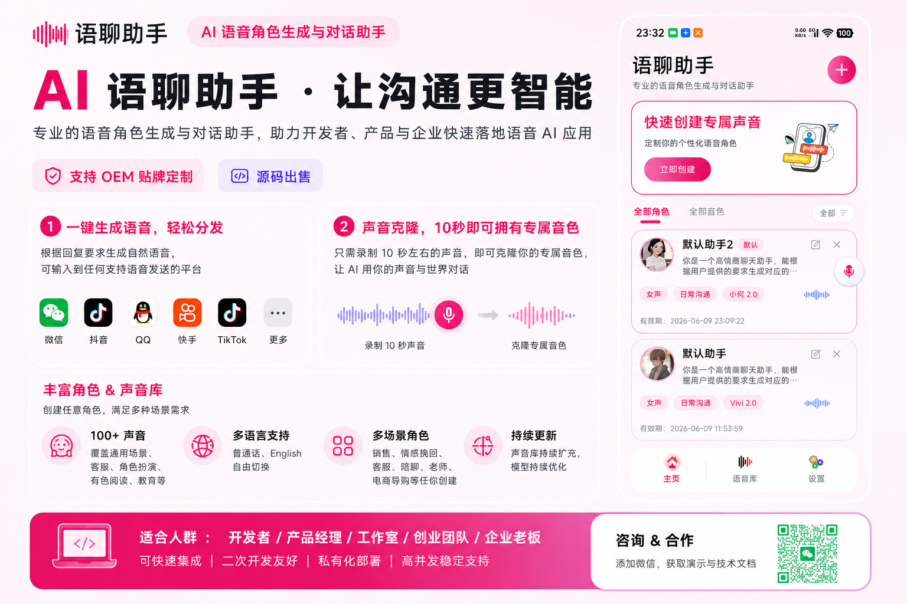

---

# App 截图

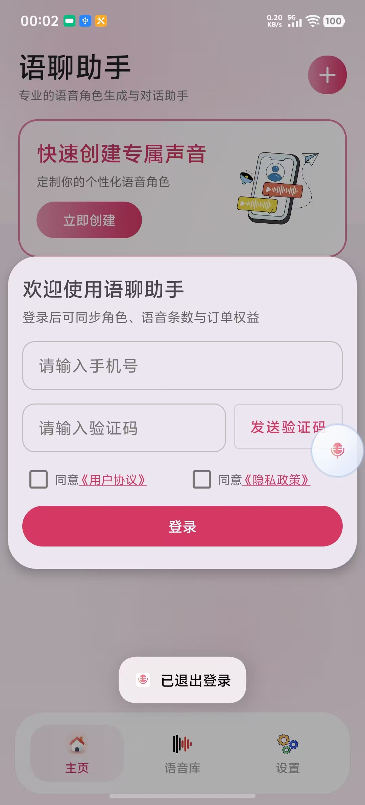
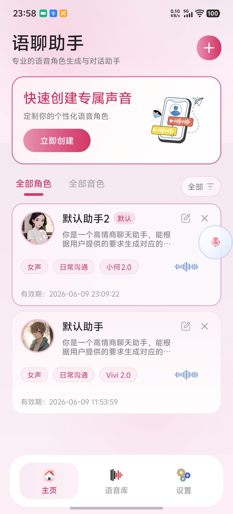
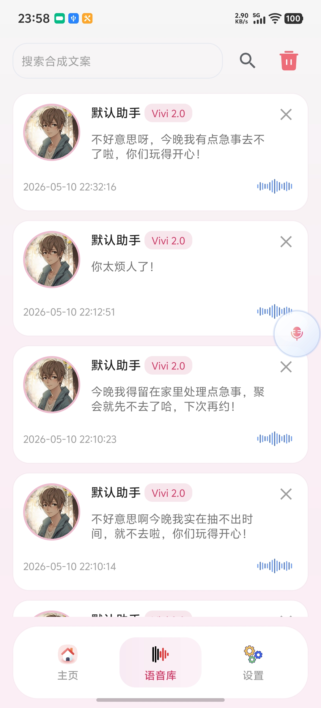
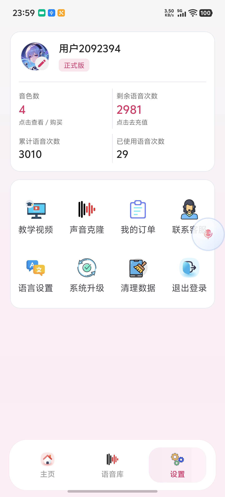

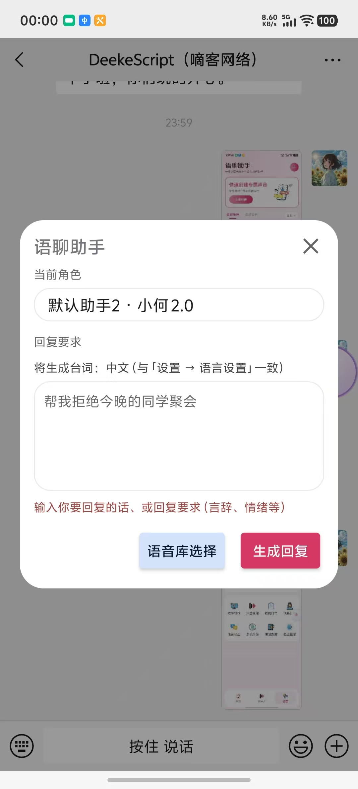
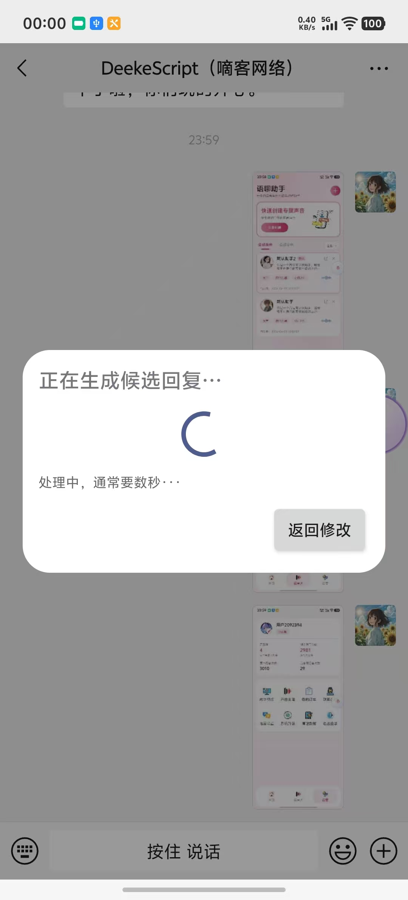
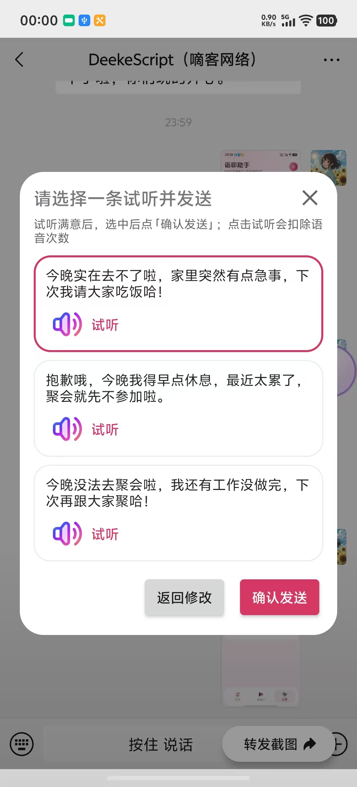
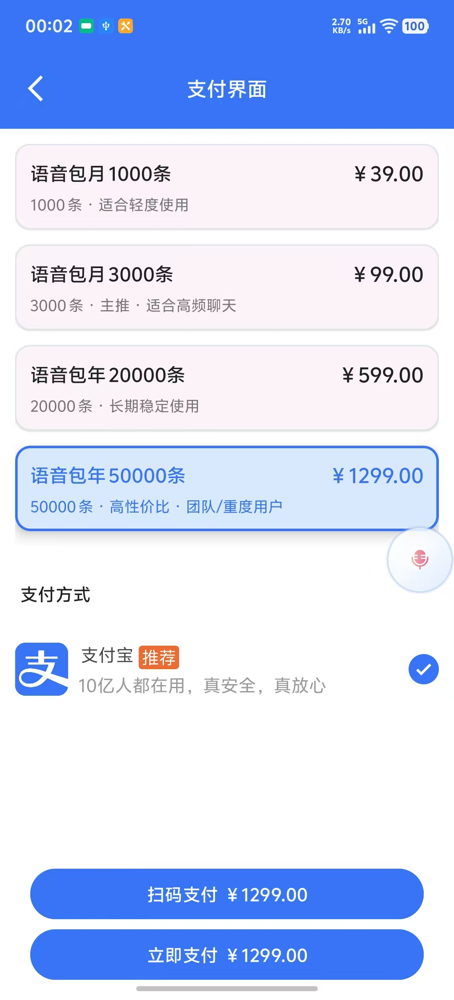

---

# 后台截图

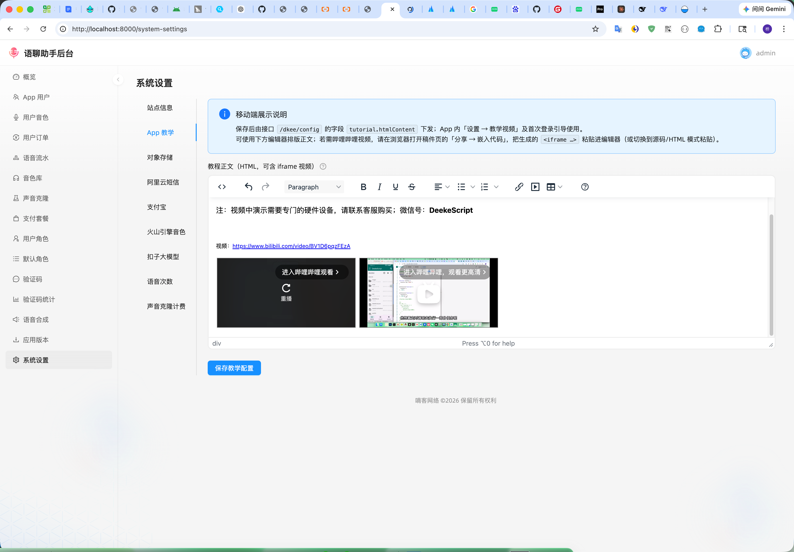

---

# 项目介绍

AI Voice Chat Assistant（AI 真人语聊助手）是一款基于：

- AI 大模型
- 实时语音合成（TTS）(逼真度100%)
- AI 音色克隆(逼真100%)
- 社交平台语音自动化

打造的新一代 AI 社交产品。

相比传统 AI 聊天：

> 我们让 AI 更像真人。

用户输入一句话，系统即可：

✅ AI 自动生成回复  
✅ 自动生成真人语音  
✅ 自动发送到社交平台  
✅ 使用克隆后的真人声音回复

支持：微信、QQ、抖音、快手、TikTok、Telegram、WhatsApp等任何支持发送语音的平台

---

# 为什么这个项目有市场？

传统 AI 聊天的问题：

- 文字缺少情绪
- 用户容易疲劳
- AI 感太重
- 缺少真实陪伴感
- 转化率低

而：

# AI + 真人声音

会显著提升：

✅ 信任感  
✅ 情绪价值  
✅ 用户沉浸感  
✅ 私域成交率  
✅ 用户停留时长  
✅ 社交真实性

尤其适用于：

- AI 陪聊
- AI 女友
- 私域销售
- TikTok 出海
- 情感付费
- 社交互动
- 陪伴经济

---

# 核心能力

---

# 1. AI 自动语音回复

用户输入内容后：

系统自动：

- 生成高情绪价值回复
- 生成真人语音
- 自动发送语音消息

真正实现：

> “AI 帮你聊天，AI 帮你成交”

支持平台：

- 微信
- QQ
- 抖音
- 快手
- TikTok
- 海外社交平台

理论上：

> 只要支持发送语音的平台，均可兼容。

---

# 2. 10 秒真人声音克隆

仅需录制约 10 秒声音：

即可快速创建专属 AI 音色。

后续所有语音回复：

都可以使用：

- 用户自己的声音
- 指定角色声音
- 克隆后的真人声音

支持：

- 普通话
- English
- 多语气
- 多情绪
- 多场景

---

# 3. 100+ 高质量音色库(逼真度100%)

系统内置 100+ 音色。

覆盖：

- 客服
- 销售
- 情感聊天
- 教育
- 角色扮演
- 有声阅读
- 社交互动
- TikTok 场景
- 海外场景

支持：

- 男声
- 女声
- 少女音
- 御姐音
- 电台音
- 磁性男声
- AI 客服音
- 英文音色

---

# 4. AI 角色系统

支持创建任意 AI 人设角色。

例如：

| 场景 | 示例 |
|---|---|
| 私域销售 | 金牌销售、成交助手 |
| AI 陪聊 | AI 女友、情感陪伴 |
| TikTok 出海 | 海外互动助手 |
| 教育培训 | 英语老师、口语陪练 |
| 社交娱乐 | 游戏陪玩、虚拟角色 |
| 直播互动 | 直播间互动助手 |

每个角色可独立配置：

- Prompt
- 回复风格
- 音色
- 语气
- 语言
- 记忆上下文

---

# 销售场景（重点）

# AI 销售助手 = 提升成交率

传统销售：

- 打字效率低
- 回复慢
- 情绪价值不足
- 客户容易流失

而 AI Voice Chat Assistant：

可以实现：

✅ 真人语音回复客户  
✅ 自动生成高情绪价值内容  
✅ 提升客户信任感  
✅ 提升成交率  
✅ 支持批量运营  
✅ 降低人工成本

适用于：

- 私域销售
- 社群运营
- 电商转化
- TikTok 私信
- 陪跑业务
- 招商加盟
- AI 陪聊
- AI 女友
- 情感项目

---

# 为什么“语音”比“文字”更容易成交？

因为：

声音拥有：

- 情绪
- 信任感
- 真实感
- 陪伴感

很多时候：

> 成交的核心，不是内容，而是情绪。

---

# 真实商业场景

---

# 私域销售

客户咨询产品时：

AI 自动生成：

- 高情绪价值回复
- 真人语音回复
- 更像真人销售

相比纯文字：

更容易：

✅ 建立信任  
✅ 提升转化  
✅ 提升复购

---

# AI 陪聊 / AI 女友

通过真人音色：

建立更强陪伴感。

适用于：

- AI 女友
- AI 陪伴
- 情感聊天
- 睡眠陪伴
- 陪聊项目

---

# TikTok / 海外社交

AI 自动语音互动：

- 提升直播互动
- 提升用户停留
- 提升私信回复率
- 提升海外转化

---

# 产品功能

---

# 用户端

## 登录系统

- 手机号 + 验证码登录
- 支持邀请码
- 支持游客模式（可选）

---

## AI 回复系统

- AI 自动回复
- 一键生成语音
- 上下文记忆
- 多角色切换
- 多语言支持

---

## 音色系统

- 创建音色
- 管理克隆音色
- 音色试听
- 音色情绪切换
- 高级音色购买

---

## 收费系统

支持：

- 按语音次数收费
- VIP 会员
- 音色购买
- 声音克隆收费
- 套餐系统

适合商业化运营。

---

# 管理后台

系统配套完整后台。

支持：

- 用户管理
- 音色管理
- AI角色管理
- 订单管理
- 套餐管理
- 系统设置
- 支付配置
- API配置
- 声音克隆审核
- 数据统计
- 敏感词管理

---

# 技术亮点

- 实时 AI 回复生成
- 真人级 TTS 语音合成
- AI Voice Clone 音色克隆
- 多平台语音兼容
- 低延迟音频处理
- 上下文记忆
- 高并发队列系统
- 模块化 SaaS 架构
- 多模型兼容
- 私有化部署支持

---

# 技术架构

## App

- Flutter
- UniApp（可选）

---

## 服务端

- PHP Laravel
- MySQL
- Redis
- Queue 队列

---

## AI 能力

- LLM 大模型
- TTS 语音合成
- Voice Clone
- Prompt Engine

---

# 为什么选择我们？

✅ 支持 OEM 贴牌  
✅ 支持源码交付  
✅ 支持私有化部署  
✅ 支持二次开发  
✅ 支持海外市场  
✅ 支持商业化运营  
✅ 支持多平台  
✅ 支持真人声音克隆

---

# OEM / 源码出售

---

# OEM 贴牌

支持替换：

- App 名称
- Logo
- UI
- 域名
- 支付配置
- 音色资源
- AI 模型接口

快速上线自己的 AI 项目。

---

# 源码出售

提供：

- 完整源码
- App源码
- 后端源码
- 管理后台
- API 接口
- 部署文档

适合：

- AI 创业者
- 工作室
- SaaS 团队
- 出海团队
- 私域团队

---

# 合作方式

支持：

- OEM 贴牌
- 源码出售
- 私有化部署
- 定制开发
- 海外项目合作

---

# 联系方式

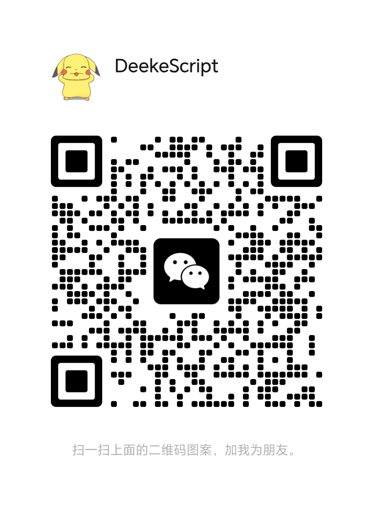

---

# License

本项目仅用于商业合作展示。
